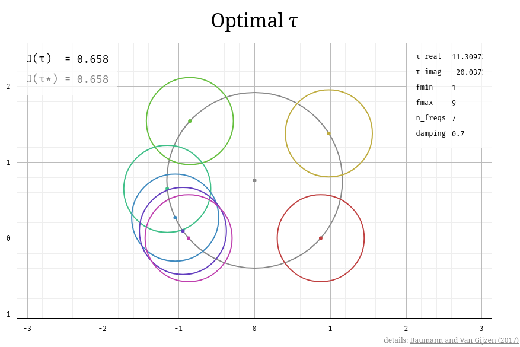

optimal τ
=========

An interactive plot of spectral bounds for preconditioned matrices arising from the
Helmholtz/Navier equation in a multi frequencies setting.

To build the website (mainly images), run `./build here`.  To update the
`gh-pages` branch, run `./build gh-pages`.  The latter requires a clean
worktree.

